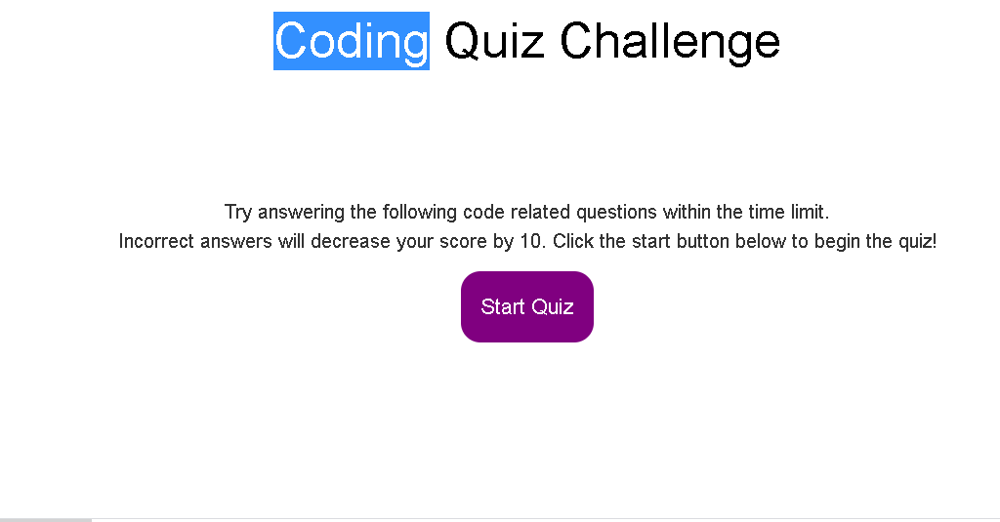

#                                             Code Quiz

This is my project where I created a Code Quiz from scratch. The Quiz includes of the criteria such as create the start button, set a timer starts, ask the questions. My page is responsive and styling is according to the demo. At the end you can save your initials aswellto local-storage.

## Contributing

1. Fork it
2. Create your feature branch (git checkout -b feature/fooBar)
3. Commit your changes (git commit -am 'Add some fooBar').
4. Push to the branch (git push origin feature/fooBar)
5. Create a new Pull Request# RfHogans-Code-Quiz
